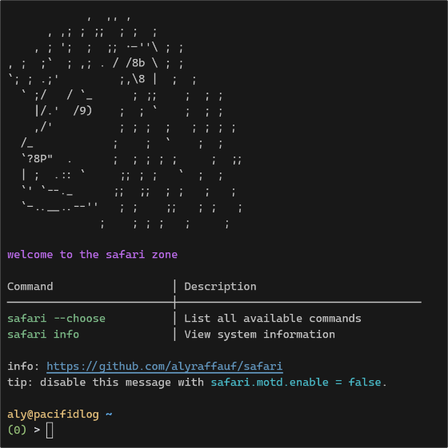

# 🚙🦁 safari

Welcome to the Safari Zone! This is an opionated set of home-manager modules that define my shell environment across devices.



---

# 🚀 Usage

To use these modules, add this repository to your flake inputs and import the 'safari' module. Then enable everything all at once:

```nix
{
  safari.enable = true;
}
```

---

## 🤝 Contributing

Open to contributions! Very much a personal setup, but contributions never hurt.

---

## 📜 License

This repository is licensed under the **[MIT License](LICENSE.md)**.

---

## ⭐ Stargazers Over Time

[](https://starchart.cc/alyraffauf/safari)

---
